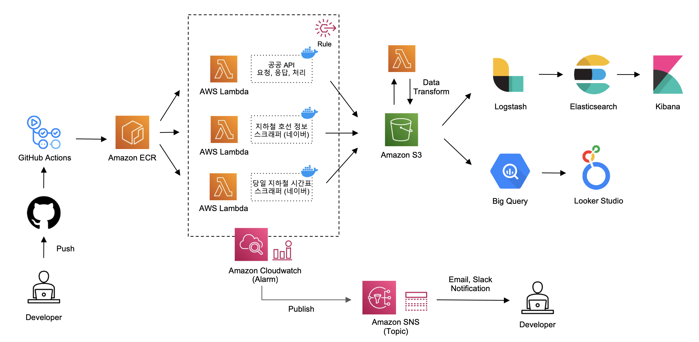

## 지하철 지연 시간 데이터 분석 및 시각화를 위한 데이터 파이프라인 구축

### ✅ 프로젝트 소개
- 발표자료: [📄 발표자료 링크](https://github.com/Italian-BMT/.github/blob/main/profile/%E1%84%8B%E1%85%B5%E1%84%90%E1%85%A1%E1%86%AF%E1%84%85%E1%85%B5%E1%84%8B%E1%85%A1%E1%86%AB%20BMT_%E1%84%8F%E1%85%A5%E1%86%AB%E1%84%91%E1%85%A5%E1%84%85%E1%85%A5%E1%86%AB%E1%84%89%E1%85%B3%E1%84%87%E1%85%A1%E1%86%AF%E1%84%91%E1%85%AD%E1%84%8C%E1%85%A1%E1%84%85%E1%85%AD%20(%E1%84%8E%E1%85%AC%E1%84%8C%E1%85%A9%E1%86%BC).pdf)
- 발표영상: [📹 발표영상 링크](https://www.youtube.com/watch?v=5XDLI-oyrN8) 

### 🏛️ 서비스 아키텍쳐

